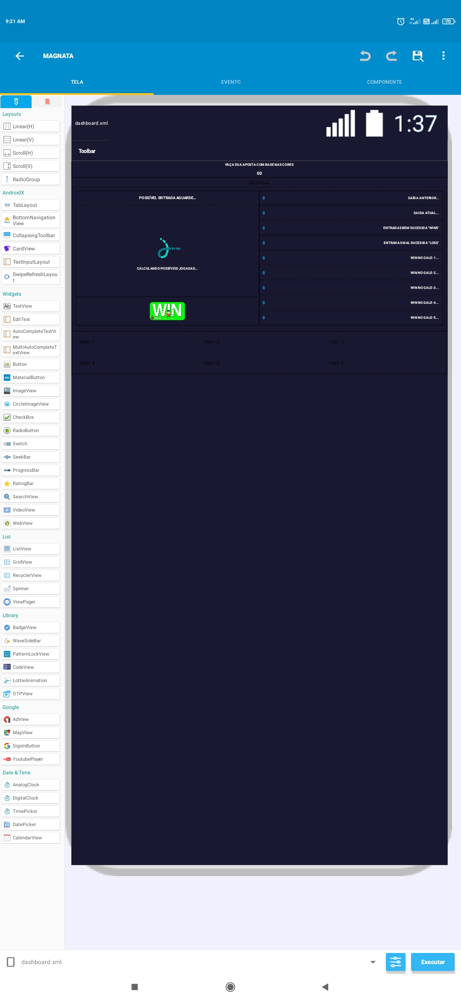

# Incrysy

    
    
    

Este é o projeto do Incrysy, um aplicativo que permite criar e editar aplicativos móveis por meio de uma interface gráfica simples e intuitiva de arrastar e soltar, sem a necessidade de conhecimentos em programação.

## Funcionalidades

O Incrysy possui as seguintes funcionalidades:

- Criação de projetos de aplicativos móveis por meio do arrastar e soltar de componentes de interface, como botões, caixas de texto e imagens
- Edição de projetos de aplicativos móveis existentes
- Personalização de cores e estilos de interface sem a necessidade de codificação
- Adição de funcionalidades de lógica por meio de blocos intuitivos de arrastar e soltar, como loops e condicionais
- Loja de templates, com uma seleção de modelos de aplicativos pré-criados para ajudar a começar
- Loja de projetos, onde os usuários podem compartilhar seus projetos criados e outras pessoas podem baixá-los e editá-los
- Venda de projetos e templates pelos usuários, que podem ganhar dinheiro compartilhando seus projetos com outras pessoas

## Como o Incrysy funciona

O Incrysy permite criar aplicativos móveis por meio de uma interface gráfica intuitiva de arrastar e soltar, sem a necessidade de codificação. Os usuários podem adicionar componentes de interface, como botões, caixas de texto e imagens, e personalizar cores e estilos sem escrever uma única linha de código. Além disso, o Incrysy oferece blocos intuitivos de arrastar e soltar para adicionar funcionalidades de lógica, como loops e condicionais.

## Contribuições

Este projeto é de código aberto e aceita contribuições da comunidade. Se você deseja contribuir com novos recursos ou correções de bugs, sinta-se à vontade para criar uma solicitação de pull request.
